# AI Research Laboratory 🤖

AI Research Laboratory is a research portfolio, project knowledge base, and visual showcase for Suleynan Aiur's work across AI agents, foundation models, scientific AI, machine learning, reinforcement learning, recommendation systems, and multimodal intelligence.


## Page Preview Gallery 🧑‍🎨


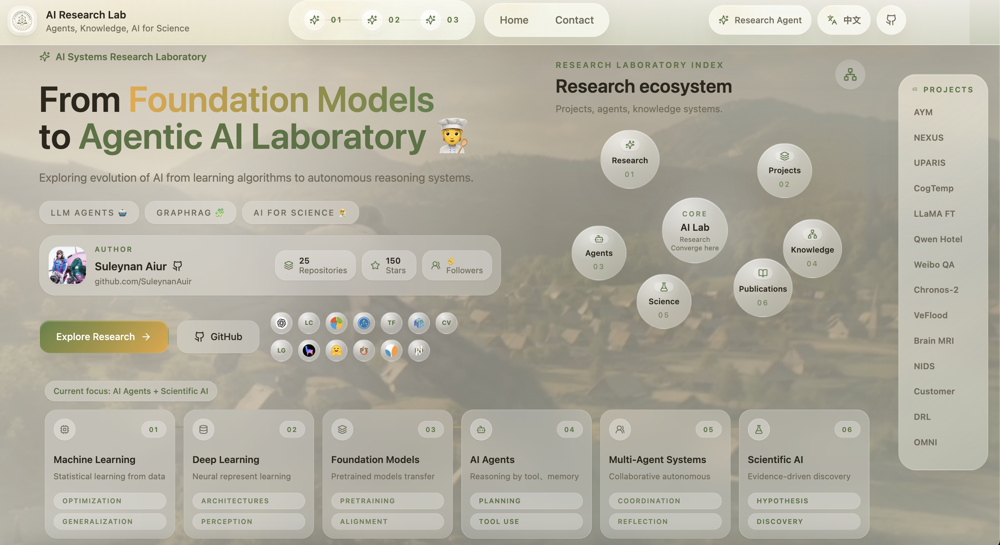

This image shows the first-screen experience of the portfolio. The left side introduces the research identity, author profile, GitHub entry, official technology icons, and research tags. The right side presents the floating research ecosystem map, where research, projects, agents, knowledge, science, and publications converge around the AI Lab core. The persistent project directory on the right provides fast jump navigation across project modules.


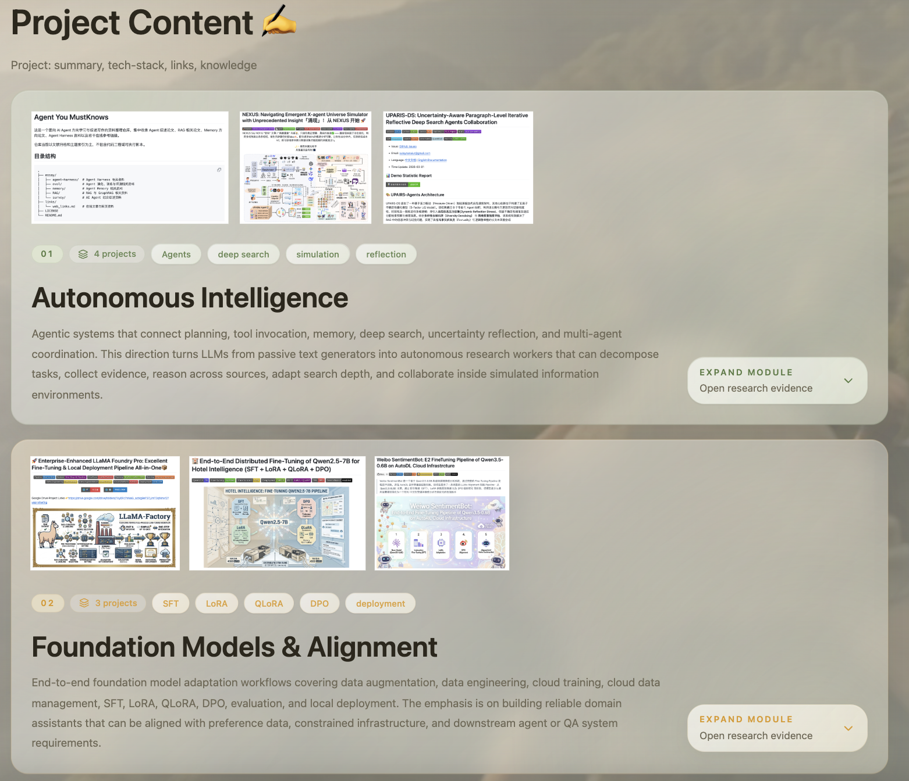

This screenshot shows the first two major project modules. `Autonomous Intelligence` groups agentic systems such as Agent-You-MustKnows, NEXUS, UPARIS-DS, and CognitiveTemp DeepSearch Agents. `Foundation Models & Alignment` groups LLaMA Factory, Qwen hotel-service fine-tuning, and Weibo sentiment alignment work. The layout highlights module-level keywords, project counts, representative images, and expandable research evidence.


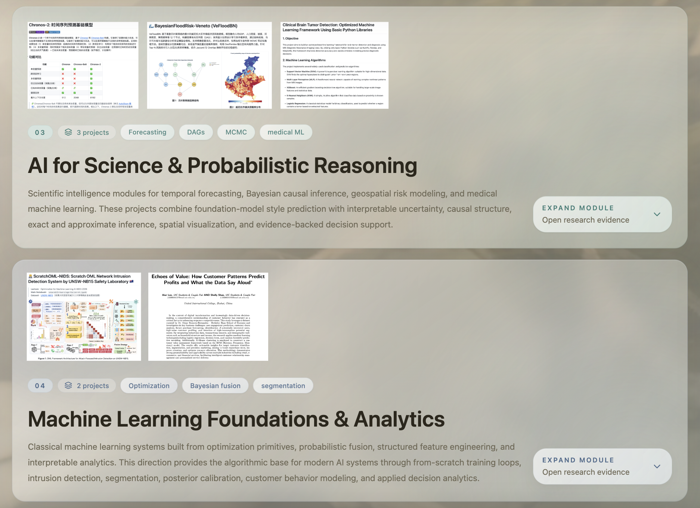

This image covers the middle layer of the research portfolio. `AI for Science & Probabilistic Reasoning` focuses on Chronos-2, Bayesian flood-risk modeling, and clinical brain tumor detection. `Machine Learning Foundations & Analytics` focuses on from-scratch optimization, Bayesian fusion, intrusion detection, customer segmentation, and interpretable analytics. The color accents separate project families while keeping the visual system consistent.


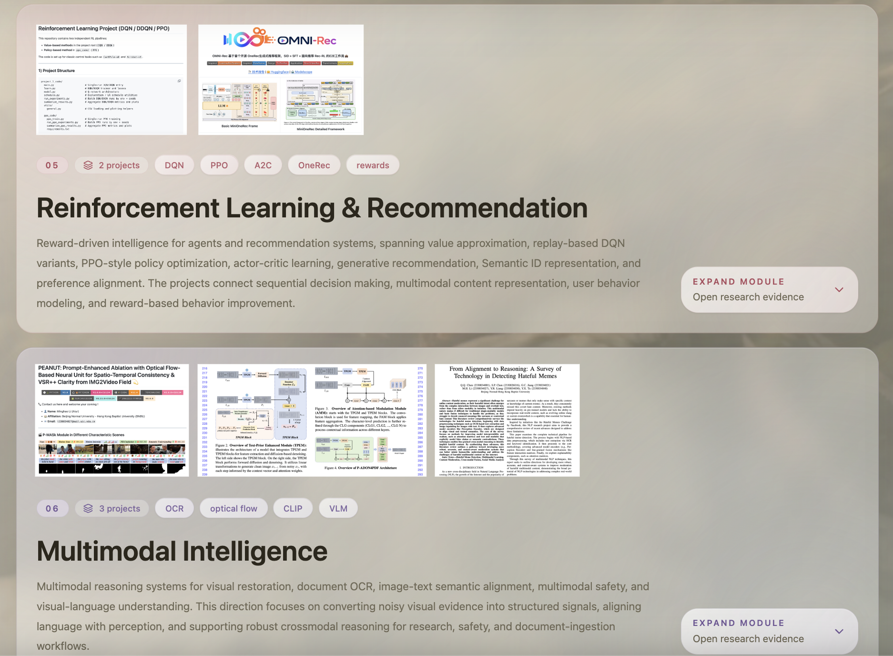

This screenshot shows the lower project modules. `Reinforcement Learning & Recommendation` connects DQN/DDQN/PPO foundations with OMNI-Rec style generative recommendation. `Multimodal Intelligence` groups PEANUT video restoration, P-ADONIS OCR, and hateful meme detection, emphasizing visual restoration, document understanding, image-text alignment, and multimodal safety.

## Expanded Project Previews


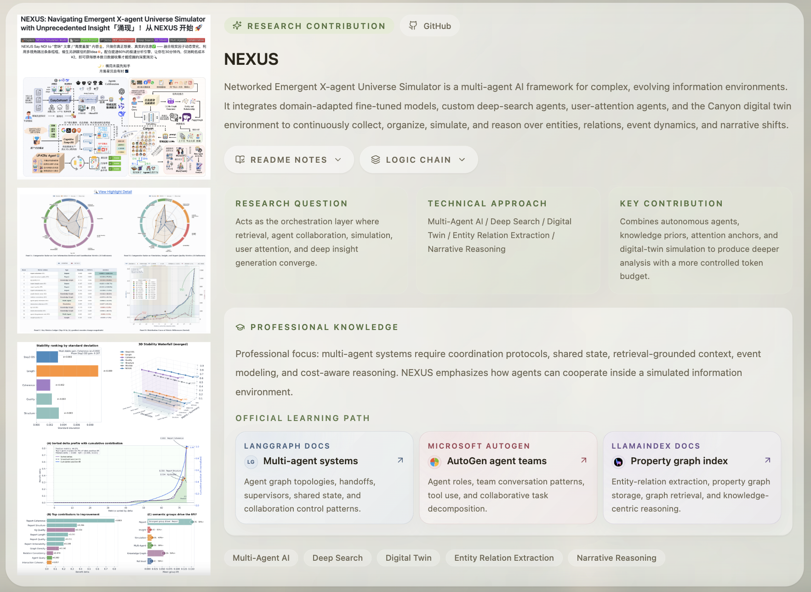

NEXUS is presented as a multi-agent framework for complex, evolving information environments. The screenshot shows project evidence images, GitHub access, README Notes and Logic Chain buttons, research question, technical approach, contribution summary, professional knowledge notes, and official learning paths. The project is positioned around multi-agent orchestration, deep search, digital twins, entity-relation extraction, and narrative reasoning.


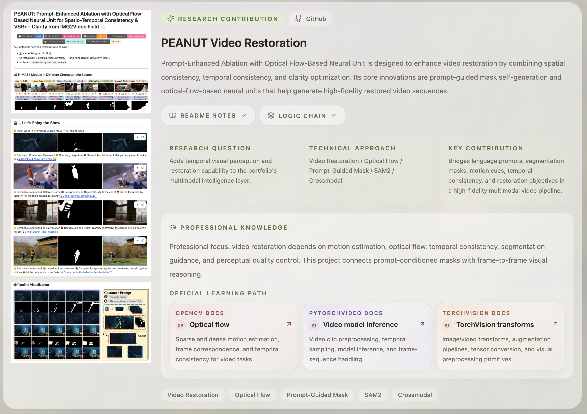

PEANUT is shown as a multimodal video restoration project that combines prompt-guided mask generation, optical flow, SAM2-style segmentation, temporal consistency, and cross-modal reasoning. The left image column demonstrates restoration examples and pipeline visualization, while the right side explains the research question, core technical route, contribution, and official learning path for OpenCV, PyTorchVideo, and TorchVision.


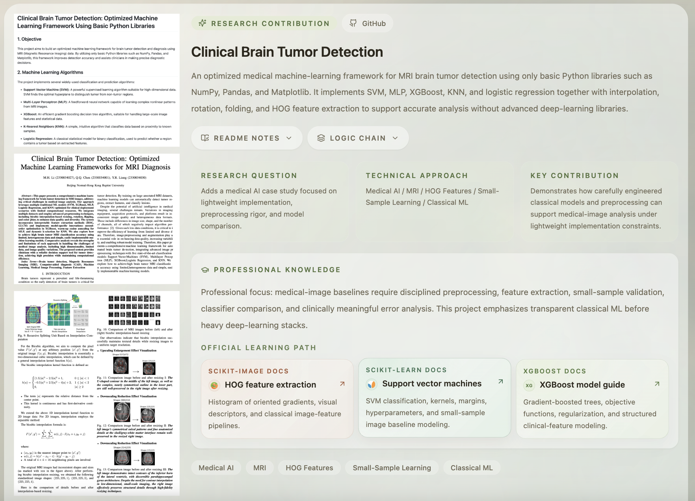

This project detail page focuses on an MRI brain tumor detection framework built with lightweight classical machine learning methods. It highlights medical-image preprocessing, HOG feature extraction, small-sample learning, SVM/MLP/XGBoost/KNN/logistic-regression comparison, and transparent evaluation. The screenshot shows how the page translates a technical medical ML project into research question, implementation approach, contribution, and learning path sections.

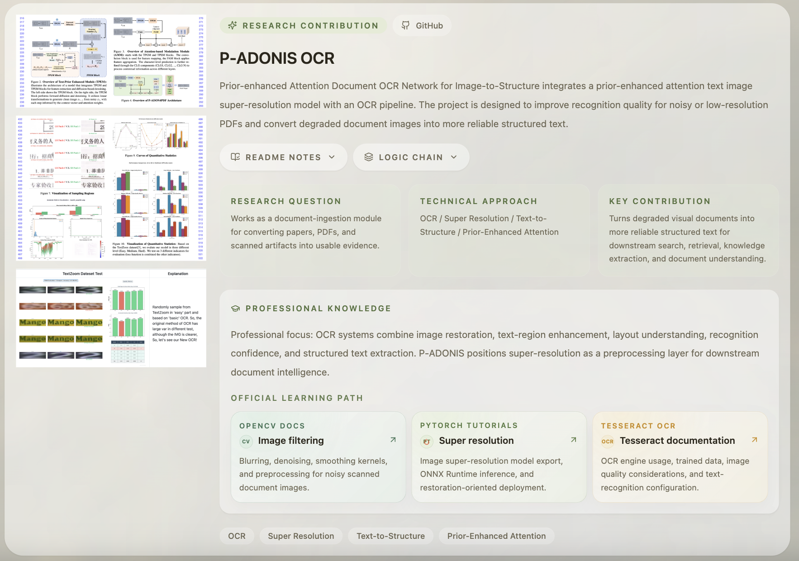

P-ADONIS is presented as a prior-enhanced attention document OCR network for converting degraded document images into structured text. The page emphasizes OCR, text-image super-resolution, document enhancement, text-to-structure conversion, and recognition reliability for noisy or low-resolution PDFs. The screenshot also shows how official learning materials are mapped to OpenCV, PyTorch super-resolution workflows, and Tesseract OCR.

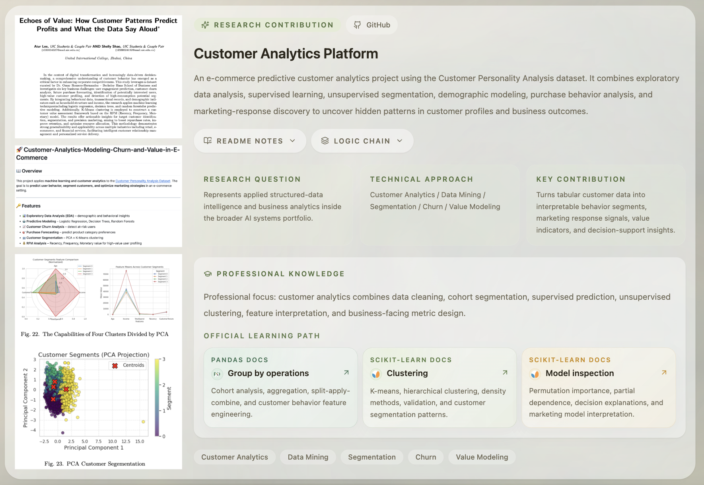

This project page explains the customer analytics system for e-commerce decision support. It combines exploratory data analysis, supervised prediction, unsupervised segmentation, churn/value modeling, customer behavior analysis, and marketing-response interpretation. The screenshot includes clustering visuals, PCA-based segmentation, README/logic controls, and learning paths for pandas and scikit-learn model inspection.


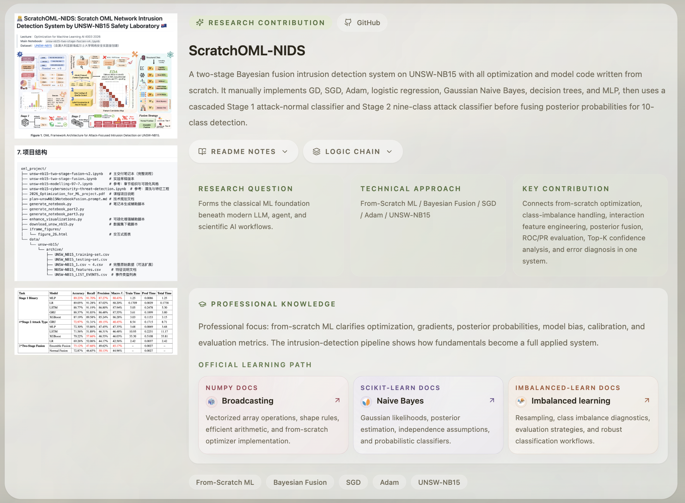

ScratchOML-NIDS demonstrates a from-scratch intrusion detection system on UNSW-NB15. The project manually implements optimization and classical ML components such as GD, SGD, Adam, logistic regression, Gaussian Naive Bayes, decision trees, and MLP, then combines them through a two-stage Bayesian fusion pipeline. The screenshot explains why this project is useful as a machine-learning foundation beneath modern agent and scientific AI workflows.


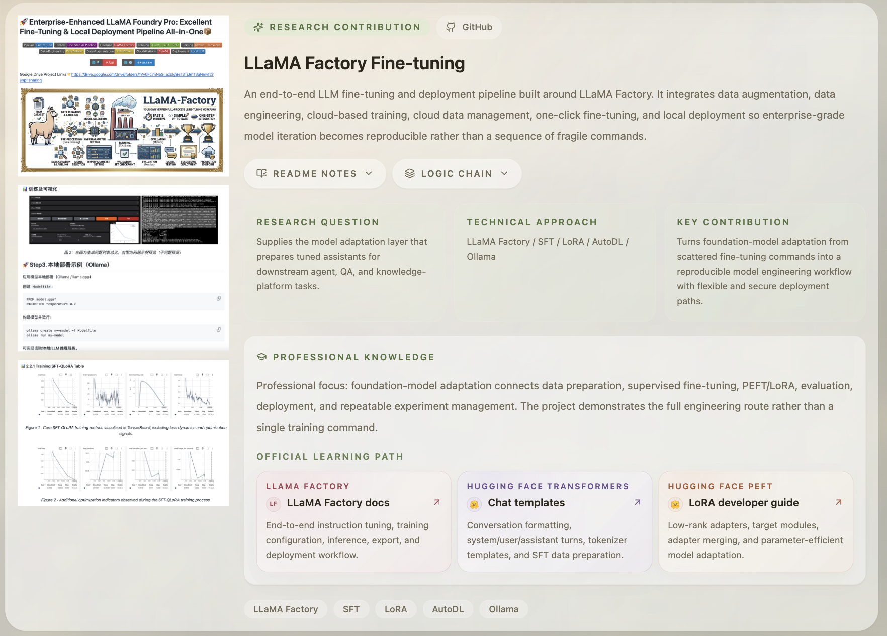

This project detail page shows an end-to-end LLM fine-tuning and deployment pipeline around LLaMA Factory. It covers data engineering, SFT, LoRA, AutoDL cloud training, Ollama/local deployment, evaluation, and reproducible model iteration. The page links the project to foundation-model adaptation and gives official learning references for LLaMA Factory, Hugging Face Transformers, and PEFT/LoRA.


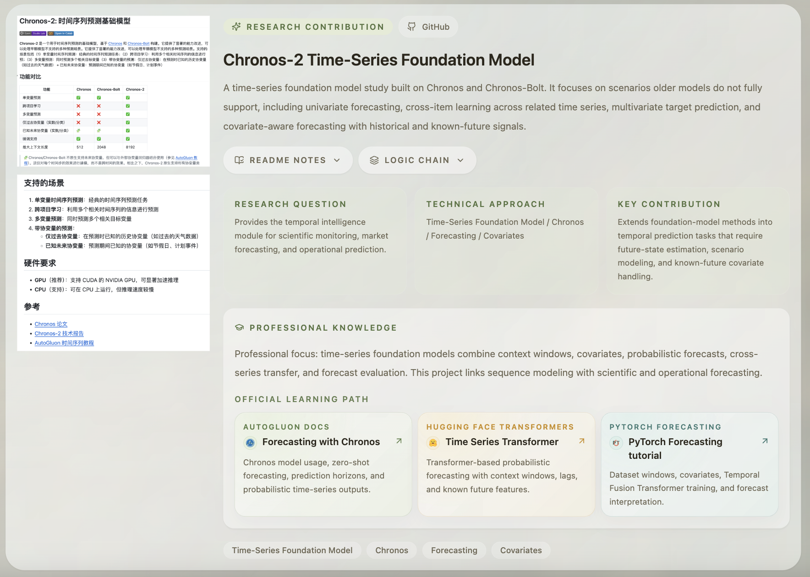

Chronos-2 is documented as a time-series foundation model study built around Chronos and Chronos-Bolt. The screenshot highlights univariate forecasting, cross-item learning, multivariate target prediction, covariate-aware forecasting, context windows, probabilistic outputs, and operational/scientific forecasting scenarios. It also shows the official learning path cards for AutoGluon Chronos, Hugging Face time-series transformers, and PyTorch Forecasting.

## Content Model

The portfolio content is organized through code and markdown-style project data:

- Project detail content: `content/projects/*.md`
- Project module data and copy: `src/data/portfolio.ts`
- English/Chinese site copy: `src/data/site-copy.ts`
- Project jump sidebar links: `src/lib/research-project-index.ts`
- Preview images for this README: `assets/page/*.png`
- Website project images used by the UI: `assets/web_page/*`

## Design Direction

The site uses a soft research-lab visual system: translucent surfaces, warm green/gold accents, animated background video, floating project navigation, bilingual content, official technology icons, and expandable project evidence sections. The goal is to make each project readable as a research contribution rather than a flat portfolio card.

## Deployment

This is a standard Next.js project and can be deployed on Vercel or any compatible Node/Next hosting environment.

1. Push the repository to GitHub.
2. Import the repository in Vercel.
3. Keep the framework preset as `Next.js`.
4. Use the default build command:

```bash
npm run build
```

5. Deploy the production branch.

## Live Routes

- English homepage: `/asrl_agent_ml_dl_cv_nlp`
- Chinese homepage: `/zh/asrl_agent_ml_dl_cv_nlp`
- Project directory sidebar: persistent shortcut navigation for the project modules
- Language switch: toggles between English and Chinese page content

## Technology Stack

- Next.js 15
- React 19
- TypeScript
- Tailwind CSS
- Framer Motion
- Lucide React icons
- Markdown/project-content driven portfolio data
